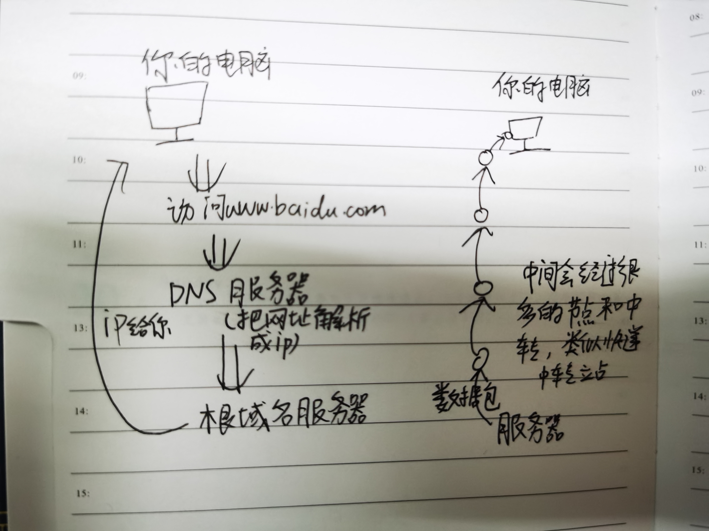
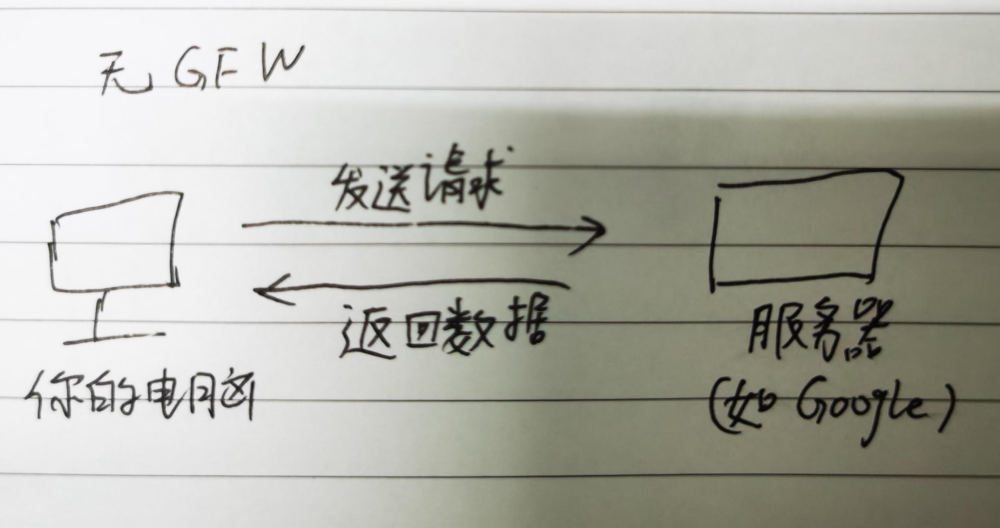
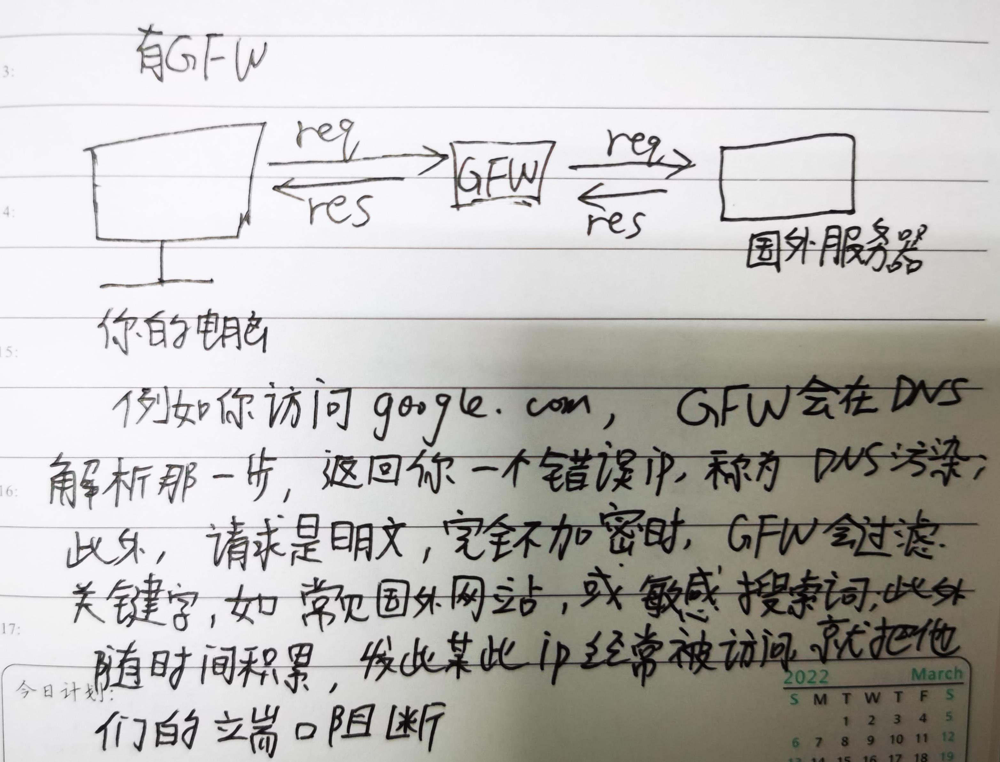
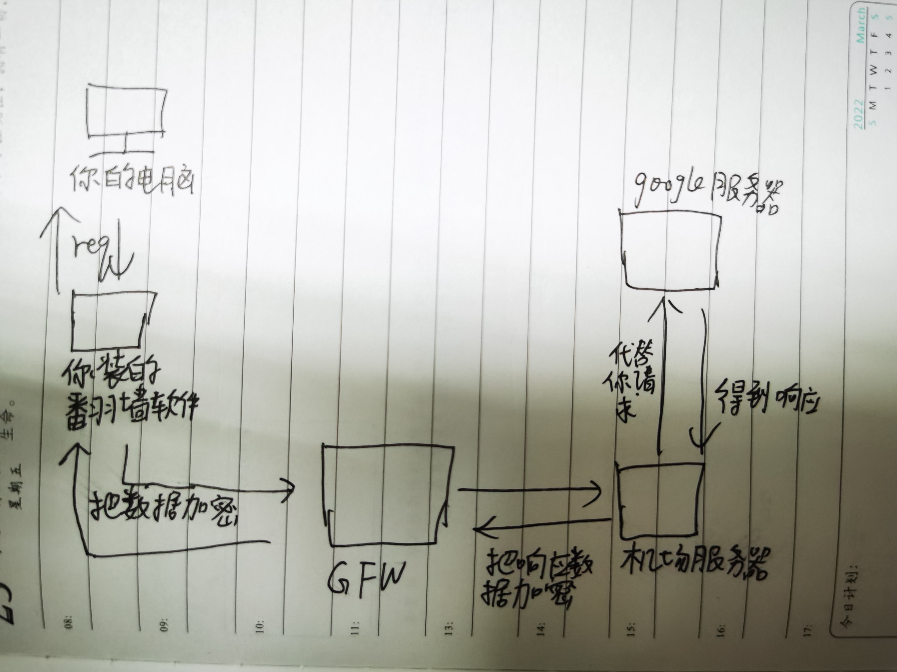

**-- Author zhiwei.wang --**

## 前言

所谓代理，类似中介。很多时候，我们无法访问某些网站，或者速度很慢，这里面通常有三类原因，一是被GFW(中国国家防火墙)
拦截了，这类无论网速快不快、国内有没有服务器都无法访问，google、facebook等都是这方面的例子；另一类是因为国内没有服务器，网络信号是通过光纤传输的，虽然光电信号非常快，但是中途会经过许多的交换机，传输速度、稳定性受到距离影响，这也是为什么有时候下载某些东西会让你选择地区，选广州，选北京，选上海什么什么的，一般原则是选近的和发达的，大多数国外中小公司都是这方面的例子；最后一类，最典型的例子是中大的服务，大家心知肚明，我就不多说了，我恨不得把他妈骨灰撒他嘴里。

## 翻墙原理

本文主要针对第一类情况，对于第一类情况，google等网站，国内无法访问，但是国外是可以的，所以如果我们想要访问google等，我们不直接给google的服务器发请求，而是请求与某个国外服务器建立加密连接，让这个服务器代替我们发送请求，这种模式即常说的VPN，这种模式基本已经倒了，因为GFW能很完美地应对VPN翻墙，一方面想使用VPN需要报备申请，此外，当越来越多的流量涌向某个代理服务器，它离被封锁就不远了。现在主流的是ShadowSocks和由其衍生出来的一系列协议，如V2ray、Trojan等。它所做的是下面这样的事，代理服务器分远程和本地两个，本地服务器由你安装地翻墙软件自动配置，在请求到达GFW前由本地代理服务器加密，数据返回到达GFW前由远程代理服务器加密，说白了翻墙最关键的一点是不要让GFW明白你数据包的真实意图，伪装成正常的流量，让它放行。目前翻墙软件中最关键的两者是协议和加密算法，往往新的协议和算法意味着更高的安全性和稳定性，但是需要注意的是新加密算法往往需要更多的cpu算力，因为加密是一个计算密集型工作。此外，软件翻墙有一大限制，即使你开启了全局代理，它也不会接管所有的请求，因为它权限不够，某些系统软件具有最高的权限，不会被翻墙软件代理

## 网络协议简述

下面简单介绍几种网络协议，主要影响的是，代理的加速效果在哪些应用能生效。注意，下面分类是不严谨的，但是对于使用来说是绰绰有余的

#### TCP协议

常见的http、https都是tcp协议，tcp建立连接需要请求方和响应方都确认，例如你打个电话，对方按了接听，这个电话才算打通了，一般浏览器里面大都是tcp协议

#### WS协议

WebSocket其实是基于TCP的http2的，这里专门拿出来，是说下常见的场景，如扫码签到，协作文档，软件开发热重载，都是基于WebSocket的

#### UDP协议

游戏、视频是最典型的udp场景，udp无需接收方确认，类似发邮件发短信，udp的缺点是会有数据包的丢失，游戏加速器显示的丢包率就跟这个相关，高清视频意味着更少丢包，会占用更多的网络带宽

## 常用翻墙软件

ShadowSocks、ShadowSocksR、V2rayN、Clash、Surge....哪个好用受很多因素影响，你的电脑，你的网络，你的机场，你的用途……自己多试试吧，我个人喜欢v2ray，手机喜欢SSR(我是安卓)

## 最后

所以你需要做的是找一个机场，这个国内就可以搜到(找到了机场后他们会有教程，随着使用你也会总结出一些经验)，你也可以问问别人啥的好用，我不予推荐，实验室那个弔校园网，万兆网卡又怎么样？机场速度起飞又怎么样？
